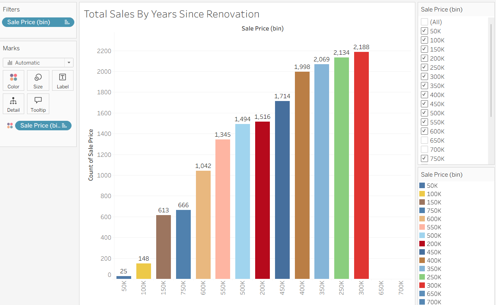
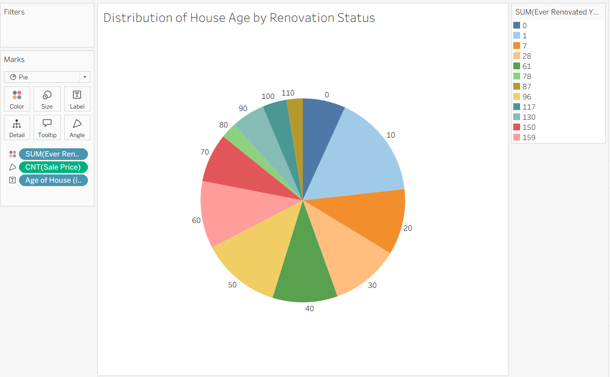
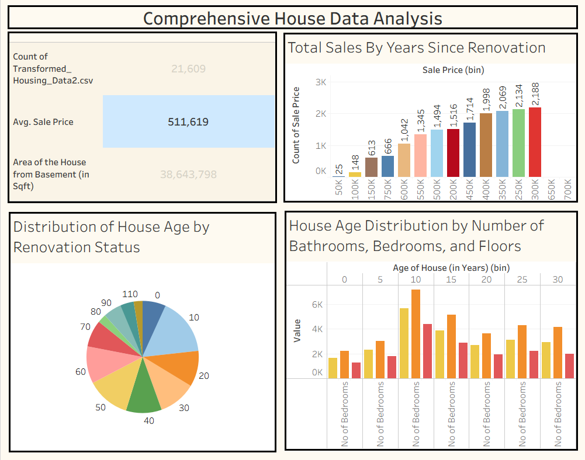

# Visualizing Housing Market Trends: An Analysis of Sale Prices and Features (Tableau)

## Project Overview
This project explores housing market trends using Tableau to visualize sale prices and key property features. The goal is to uncover patterns, highlight influential factors, and present insights through clear, interactive visuals and a consolidated dashboard.

## 🎯 Project Objectives
- Analyze housing market trends and factors influencing house prices
- Visualize the relationship between house features (bathrooms, bedrooms, floors) and sales prices
- Understand the impact of renovations on property values
- Create interactive dashboards for data-driven decision making
- Deploy a web-based interface for easy access to insights

## Dataset
- File: [data/Transformed_Housing_Data2.csv](data/Transformed_Housing_Data2.csv)
- Location: `data/Transformed_Housing_Data2.csv`
- Download: Click the file link above to download the dataset

## Data Collection and Extraction
- Source: Provided dataset file (`Transformed_Housing_Data2.csv`)
- Download form: Local file in the workspace (no external download required)

## Data Preparation
This process helps to make the data easily understandable and ready for creating visualizations to gain insights into the performance and efficiency. Follow these steps to make sure it’s ready for analysis:

**Data Review & Exploration:**
Take some time to explore your data by checking the data types, value ranges, and distributions. This helps you understand the structure of your dataset, spot any outliers, and get familiar with what you’ll be working with.

**Filtering and Structuring for Purpose:**
Depending on your project goals, you might want to filter the data to focus on specific parts—like certain years, regions, or categories. Organizing your data this way will make your visualizations clearer and more relevant.

**Field Renaming & Final Formatting:**
Rename any confusing field names to make them easier to understand. Also, double-check that dates, numbers, and other data types are correct, especially if you’re working with multiple tables.

**Optional Calculated Fields:**
If needed, create new fields using calculations—like profit margins or growth rates—to add more insights to your analysis.

**Validation for Accuracy:**
Lastly, quickly verify your data by comparing key numbers with the original source or summary stats. This helps ensure your analysis will be trustworthy.

## Data Analysis Scenarios

### Scenario 1: Overall Data Overview
This visualization presents a summary of the dataset, showing:

- Count of transformed housing data records
- Average sales price
- Total area of houses from the basement (in square feet)

This overview provides a quick snapshot of the dataset's scale and key metrics, offering stakeholders a foundational understanding of the data being analyzed.

Visualization: Overall Data Overview

### Scenario 2: Total Sales by Years Since Renovation
This histogram illustrates the distribution of total sales based on the number of years since a house was renovated. The bars represent different sales price bins, highlighting how recently renovated houses correlate with varying price ranges.

Key Insights:

- Impact of renovations on house prices
- Trends in buyer preferences regarding renovated homes
- Correlation between renovation timing and market value

Visualization:



### Scenario 3: Distribution of House Age by Renovation Status
This pie chart shows the distribution of houses based on their age and renovation status. Each segment represents a different age group, providing insight into:

- Age distribution across the housing dataset
- Proportion of renovated vs. non-renovated houses
- Age characteristics of the housing inventory

Visualization:



### Scenario 4: House Age Distribution by Number of Bathrooms, Bedrooms, and Floors
This grouped bar chart displays the distribution of house ages categorized by:

- Number of bathrooms
- Number of bedrooms
- Number of floors

It shows how houses of different ages are distributed according to these attributes, offering a detailed view of how house features vary with age.

Visualization:


## 🛠️ Technologies Used
- Tableau - Data visualization and dashboard creation
- Python - Data processing and analysis
- Flask - Web framework for dashboard integration
- HTML/CSS/JavaScript - Frontend for web interface
- Pandas - Data manipulation and preparation
- CSV - Data storage format

## 📁 Project Structure
```
HomeScope/
├── README.md                          # Project documentation
├── data/                              # Data files and processing scripts
│   └── Transformed_Housing_Data2.csv  # Cleaned dataset
├── images/                            # Visual exports
├── tableau/                           # Tableau workbooks and exports
│   ├── dashboards/
│   └── visualizations/
├── web/                               # Web integration files
│   ├── templates/                     # HTML templates
│   ├── static/                        # CSS, JS, images
│   │   ├── css/
│   │   ├── js/
│   │   └── images/
│   └── requirements.txt               # Python dependencies
└── docs/                              # Additional documentation
    └── performance_testing.md
```

## Usage
### Data Preparation
- Review and validate the dataset in `data/Transformed_Housing_Data2.csv`.
- Apply filtering, renaming, and calculated fields as required for the analysis goals.

### Creating Visualizations
- Open the dataset in Tableau.
- Build the charts listed in the Data Analysis Scenarios section.
- Export visuals to the `images/` folder.

### Dashboard Access
- Open the Tableau dashboard from `tableau/dashboards/`.
- Use filters to explore trends by renovation status, house age, and features.

## 📊 Dashboard & Visualizations

### Interactive Dashboard


Features:

- Interactive filters for data exploration
- Real-time updates based on user selection
- Responsive design for mobile and desktop
- Export functionality for reports

### Key Visualizations
- Sales Trend Analysis
- Feature Correlation Matrix
- Geographic Distribution

## ⚡ Performance Testing
Performance testing criteria include:

### Data Filters
- Filter Response Time:
- Filter Combinations:
- Data Load Time:

### Calculation Fields
- Number of Calculated Fields:
- Calculation Complexity:
- Performance Impact:

### Visualizations/Graphs
- Total Number of Visualizations:
- Average Render Time:
- Dashboard Load Time:

### Performance Benchmarks
- Initial Load:
- Filter Application:
- Dashboard Refresh:

## 🌐 Web Integration
This repository contains the web integration of the Tableau dashboards using Flask.

### Flask Application Structure
- `web/` contains templates and static assets for the UI.

### Embedded Dashboard
The Tableau dashboard is embedded into the web application using Tableau's JavaScript API, providing:

- Seamless integration with existing web applications
- Custom styling and branding
- Enhanced user authentication and access control
- Extended functionality through custom interactions

### API Endpoints
- Define endpoints in the Flask app for data delivery and embedding support.

### Deployment
- Run the Flask app locally or deploy to a hosting platform.

## 🎬 Project Demonstration
- Screenshots: See the `images/` folder
- Video Walkthrough: TBD
- Live Demo: TBD

## 📝 Documentation
For detailed documentation on each component:

- Data Collection Process
- Data Preparation Guide
- Visualization Guidelines
- Dashboard User Guide
- Performance Testing Results
- Deployment Guide

## 👥 Contributors
<table>
    <tr>
        <td align="center">
            
            <br />
            <strong>Tavishi Agarwal</strong>
            <br />
            <a href="https://github.com/tavishi-agarwal">@tavishi-agarwal</a>
        </td>
        <td align="center">
            
            <br />
            <strong>Vivek</strong>
            <br />
            <a href="https://github.com/Vivekpatel1234a">@Vivekpatel1234a</a>
        </td>
        <td align="center">
            
            <br />
            <strong>Yash Singhal</strong>
            <br />
            <a href="https://github.com/yashsinghal1234">@yashsinghal1234</a>
        </td>
        <td align="center">
            
            <br />
            <strong>Saurav Singh</strong>
            <br />
            <a href="https://github.com/Nova-022005">@Nova-022005</a>
        </td>
    </tr>
</table>

## 📄 License
Note: This project is part of a comprehensive housing market analysis initiative. All data has been transformed and anonymized for analysis purposes.
